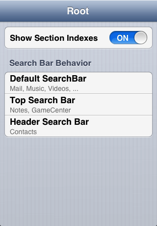

*TableViewSearchBar* is a small demo project that demonstrates the various scrolling behaviors of a UISearchBar inside a UITableView found in Apple's own apps.

The project has been made in order to answer [this stackoverflow question](http://stackoverflow.com/questions/14759506/ios-native-contacts-app-sticky-search-bar-and-section-header-behavior "iOS native Contacts App: sticky search bar and section header behavior").

There are three different behaviors in Apple's apps:

- **Default**: The search bar scrolls with the table view
- **Top**: The search bar scrolls with the table view but always stays at the top if you scroll the table view up
- **Header**: The search bar usually stays at the top of the table view but scrolls with the table view if you scroll the table view up

The last one is only used in the Contacts app and is quite interesting. Take a look at [FKRHeaderSearchBarTableViewController.m](TableViewSearchBar/FKRHeaderSearchBarTableViewController.m "FKRHeaderSearchBarTableViewController.m") in order to see how it works in detail.

- - -

